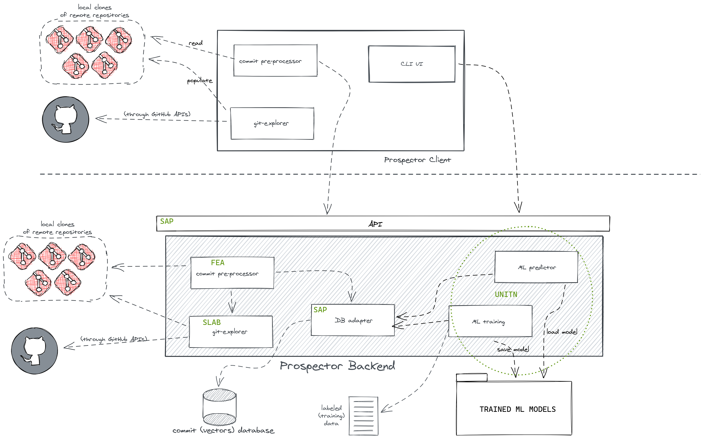

# Prospector

Prospector is a tool to reduce the effort needed to find security fixes for
*known* vulnerabilities in open source software repositories.

It takes a vulnerability description (in natural language) in input and
produces in output a ranked list of commits, in decreasing order of relevance.





**WARNING** Please keep in mind that Prospector is a research prototype, currently
under development: feel free to try it out, but do expect some rough edges.

If you find an bug, please open an issue. I you can also fix the bug, please
create a pull request (make sure it includes a test case that passes with your correction
but fails without it)

## Setup (for development and demonstration purposes only!)

The easiest way to set up Prospector is to clone this repository and then run the following commands:

```
git clone https://github.com/sap/project-kb
git checkout prospector-assuremoss
cd project-kb/prospector
echo "GIT_CACHE=/tmp/git-cache" > .env
echo "PYTHONPATH=." >> .env
echo "POSTGRES_PASSWORD=example" >> .env
mkdir /tmp/git-cache
pipenv shell
pipenv install
pre-commit install
python -m spacy download en_core_web_sm
```

If you have issues with the above commands, please open a Github issue and
explain in detail what you did and what unexpected behaviour you observed.
Please also indicate your operating system and Python version.

*Please note that Windows is not supported.*

## Starting the backend database

Note: this section and the following assume you have performed succesfully the
steps in the *setup* section above.

This is achieved with docker and docker-compose, make sure you have both installed
and working before proceeding.

You can start the database (postgresql) with the following command:

`docker-compose up -d --build`

This also starts a convenient DB administration tool at http://localhost:8080

## Starting the RESTful server

`uvicorn api.main:app --reload`

You can then point your browser to `http://127.0.0.1:8000` to access the API.
You might also want to take a look at `http://127.0.0.1:8000/docs`.

## Using the CLI

NOTE: this is about the "legacy" CLI. A new CLI is being developed.

`python main.py <vulnerability_id> -r <repository_url> -v`

## Credits

This project was initially developed by Daan Hommersom as part of his thesis
done in partial fulfillment of the requirements for the degree of Master of
Science in Data Science & Entrepreneurship at the Jheronimus Academy of Data
Science during a graduation internship at SAP.

The original code developed by Daan Hommersom [can be retrieved
here](https://github.com/SAP/project-kb/releases/tag/DAAN_HOMMERSOM_THESIS).
